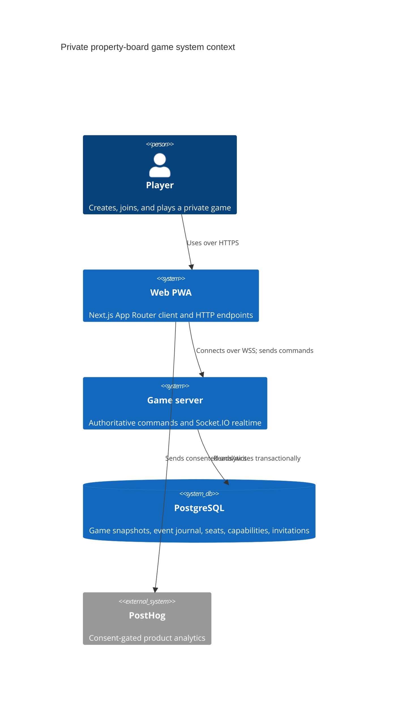
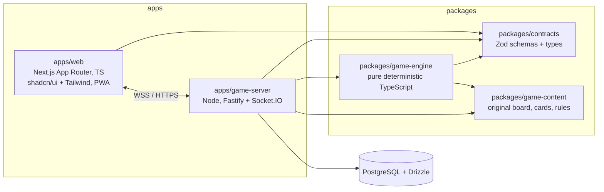
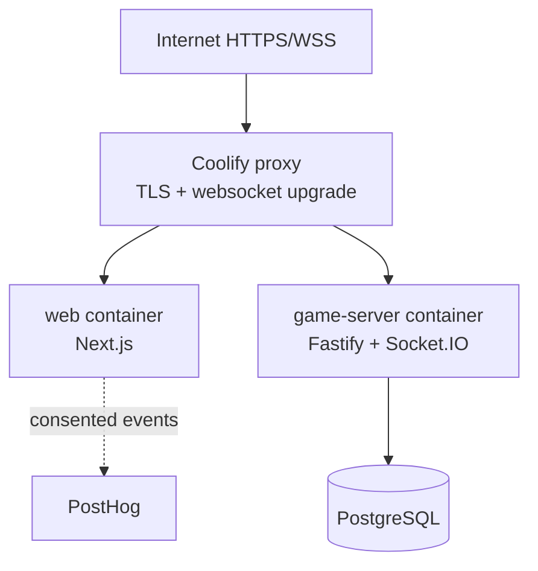

# Engineering Architecture

**Status:** implementation baseline  
**Companion documents:** [PRD](../product/prd.md), [rules](../product/rules.md), [game content](../product/game-content.md), [glossary](../product/glossary.md), [UX](../design/ux-spec.md), [game engine](game-engine.md), [realtime and data](realtime-and-data.md), and [security, privacy, and analytics](security-privacy-analytics.md).

## ENG-001: Architectural goals and constraints

Build a private, browser-playable, original-property board-game experience for two to six players. The system must be server-authoritative, recover a game after a process restart, tolerate duplicate network delivery, and run as a small self-hosted deployment on Coolify. The product is a Next.js PWA, not a native app; follow the [official Next.js PWA guide](https://nextjs.org/docs/app/guides/progressive-web-apps).

Non-goals for the initial deployment: public matchmaking, user accounts, chat, payment, multi-region failover, and Redis. The game content must use original names, art, text, and card copy; it must not import branded board-game assets or text.

## ENG-002: Workspace and container boundaries

Use a pnpm workspace. The browser must never be trusted to evaluate a final game outcome. The web app may render a local projection or preview an allowed action, but only the game server calls the engine to accept a command.

| Boundary | May depend on | Must not depend on |
|---|---|---|
| `apps/web` | `contracts`; presentation-only content metadata | game-server internals, Drizzle, database credentials |
| `apps/game-server` | `contracts`, `game-engine`, `game-content`, Drizzle | Next.js runtime or browser globals |
| `packages/game-engine` | `contracts`, `game-content` interfaces | Node APIs, time, randomness, IO, database, Socket.IO |
| `packages/contracts` | Zod only | React, Fastify, database, engine implementation |
| `packages/game-content` | data and validation helpers | infrastructure and proprietary/branded content |

`contracts` is the wire and persistence compatibility boundary. Export both the Zod schema and `z.infer` type; do not hand-maintain duplicate interfaces. `game-content` declares a versioned `RuleSet`, board spaces, deck definitions, and original copy. `game-engine` consumes a content snapshot selected when a game is created, never mutable “current” content.

## ENG-003: Request and data paths

1. **Create game:** Next.js calls a Fastify HTTP endpoint. The server chooses the current content/rules version and writes `games`, initial snapshot, host seat, game-seat command capability, separate host capability, invitation, and `GameCreated` journal event in one PostgreSQL transaction, then returns a shareable URL. The URL carries an opaque invite ID only.
2. **Join/reconnect:** the web app presents its same-site, game-seat-scoped capability cookie to the game server. The server validates the invitation and capacity, assigns or reconnects that seat transactionally, and emits its authorized state envelope. Invitation possession alone never identifies or authorizes a prior player.
3. **Command:** client sends a validated `CommandEnvelope` over Socket.IO with `commandId`, `expectedVersion`, and payload. The server authenticates the game-seat capability, validates seat/phase/legal action, evaluates the pure engine, appends all resulting events, updates snapshot/version, records command ID, commits, then broadcasts the authoritative event/state delta.
4. **Catch-up:** client sends its last applied sequence/version. The server returns retained events when contiguous; otherwise it sends a complete authorized snapshot. See [PROTO-004](realtime-and-data.md#proto-004-catch-up-resync-and-stale-data).

The command handler is the serialization point: execute each game command in a database transaction under a per-game PostgreSQL advisory transaction lock (or equivalent locked game row). Use `games.aggregate_version` in the update predicate. On conflict, return a stale-version error; never retry an action against a changed state silently.

## ENG-004: Deployment

Coolify deploys two independently built Docker images from the workspace plus managed/self-hosted PostgreSQL. Terminate TLS at Coolify’s proxy and forward HTTP and WebSocket upgrades to the appropriate service. Give each service a distinct internal hostname; expose only web and game-server routes through the proxy. Configure `NEXT_PUBLIC_GAME_SERVER_URL` to the public WSS origin and server-only database/PostHog secrets through Coolify secrets.

Initial game-server deployment is one replica with Socket.IO in-memory room membership. Health endpoints: `/health/live` means process alive; `/health/ready` verifies database reachability. Use graceful shutdown: stop accepting connections, notify sockets/retryable disconnect, wait for in-flight command transactions, then close DB.

Redis is intentionally deferred. Before adding a second game-server replica, add Redis for Socket.IO adapter/pub-sub, distributed rate limiting, and cross-instance presence; use sticky WebSocket routing during the transition. This is detailed in [ENG-017](realtime-and-data.md#eng-017-expiry-backup-recovery-and-scale).

## Decisions

| ID | Decision | Rationale |
|---|---|---|
| ENG-005 | Dedicated Fastify + Socket.IO game service, separate from Next.js | Keeps long-lived, authoritative realtime state and deployment lifecycle independent of UI rendering. |
| ENG-006 | Pure engine package | Makes rules deterministic, unit-testable, replayable, and isolated from transport. |
| ENG-007 | Snapshot plus append-only event journal | Fast reconnect reads plus forensic/replay history without reconstructing every join from genesis. |
| ENG-008 | PostgreSQL first; Drizzle access layer | One transactional durable store is simpler and sufficient at one realtime replica. |
| ENG-009 | Game-seat command capability with server-side token hash | An invite may be shared without becoming authority over an occupied seat. |
| ENG-010 | Versioned contracts/content/state | Enables explicit compatibility checks and controlled migrations. |

## ENG-012: Rejected alternatives

| Alternative | Rejected because |
|---|---|
| Client-authoritative rules or peer-to-peer state | Enables cheating and makes recovery/dispute resolution unreliable. |
| Put Socket.IO handlers inside Next.js route handlers | Couples persistent socket behavior to a web runtime/deployment model not chosen for it. |
| Redis from day one | Adds operational complexity before any horizontal realtime need; PostgreSQL transactions cover required consistency. |
| Event sourcing without snapshots | Reconnect and reads become increasingly expensive; snapshots are needed for bounded recovery latency. |
| Snapshots without an event journal | Loses auditability, deterministic debugging, and safe catch-up. |
| Invite URL as the reconnect credential | Anyone with a copied URL could impersonate a seated player. |
| Source-compatible or superficially renamed content | Legal and product risk; all names, presentation, cards, values, and copy must be independently authored. |

## ENG-013: Implementation acceptance checklist

- Workspace dependency rules above are enforced through package exports, TypeScript project boundaries, and CI lint checks.
- All command effects pass through the engine and one transactional persistence path.
- A game can be restored from its latest snapshot plus later journal events to the exact aggregate version.
- UI and protocol implementation follows [game engine](game-engine.md) and [realtime/data](realtime-and-data.md); controls and telemetry follow [security/privacy/analytics](security-privacy-analytics.md).
- Product and UX behavior follows the linked PRD, rules, content, glossary, and UX specifications using their documented precedence.

## ENG-014: Primary implementation references

- [Next.js Progressive Web Apps](https://nextjs.org/docs/app/guides/progressive-web-apps) and [App Router](https://nextjs.org/docs/app) documentation.
- [Fastify documentation](https://fastify.dev/docs/latest/), [Socket.IO server documentation](https://socket.io/docs/v4/server-initialization/), and [Socket.IO Redis adapter](https://socket.io/docs/v4/redis-adapter/).
- [Drizzle ORM documentation](https://orm.drizzle.team/docs/overview), [Zod documentation](https://zod.dev/), and [PostgreSQL transactions](https://www.postgresql.org/docs/current/tutorial-transactions.html).
- [Coolify documentation](https://coolify.io/docs/), including its deployment and proxy configuration appropriate to the installed version.
