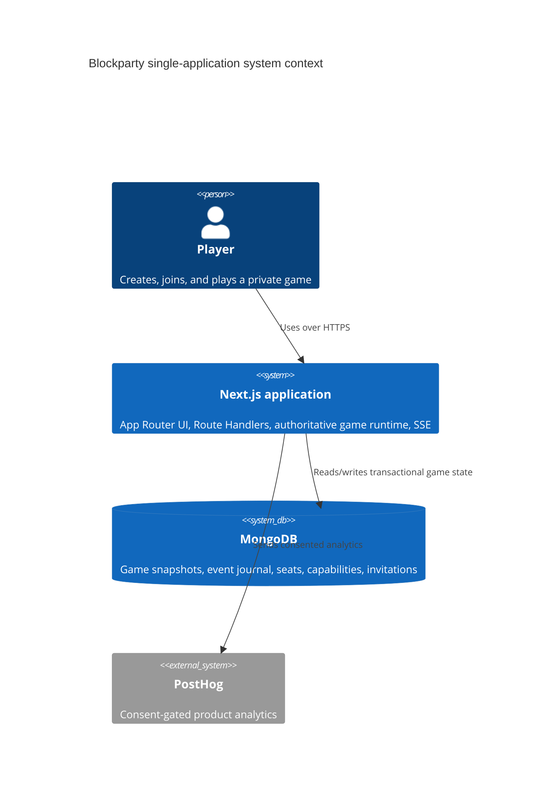
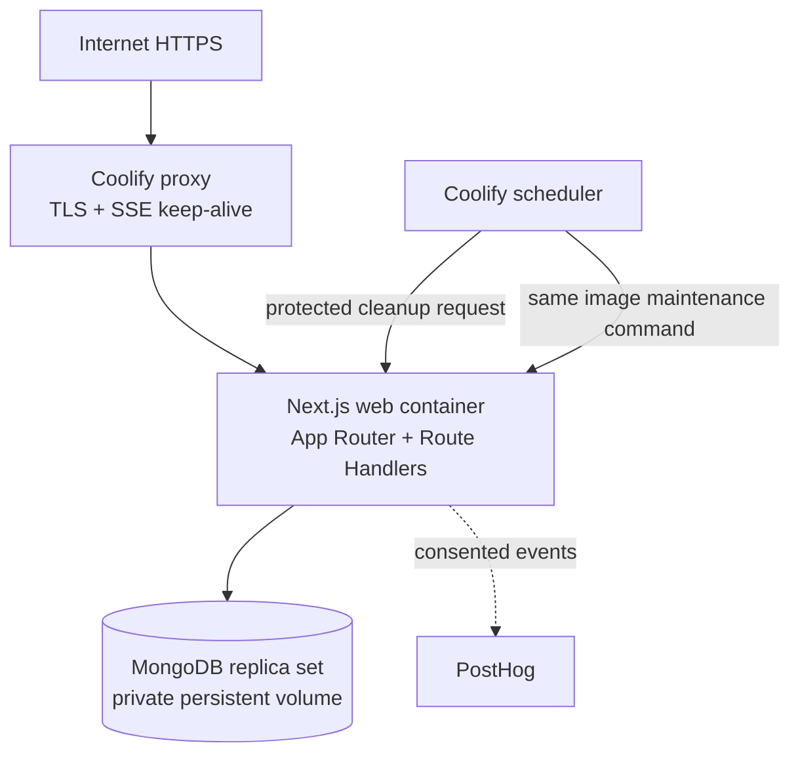

# Engineering Architecture

**Status:** final implementation baseline

**Decision:** one deployable Next.js application backed by MongoDB

**Companion documents:** [PRD](../product/prd.md), [rules](../product/rules.md), [variants](../product/rule-variants.md), [game content](../product/game-content.md), [glossary](../product/glossary.md), [UX](../design/ux-spec.md), [game engine](game-engine.md), [realtime and data](realtime-and-data.md), [security, privacy, and analytics](security-privacy-analytics.md), [test strategy](../delivery/test-strategy.md), and [operations](../delivery/operations.md).

This document records the final application shape for Blockparty. It supersedes the earlier proposal for a separately deployed Fastify/Socket.IO game server and PostgreSQL/Drizzle persistence layer. The product remains a private, browser-playable, original-property board game for two to six players. Product behavior and rules remain defined by the higher-precedence documents linked above.

## ENG-001: Architectural goals and constraints

Build a free, self-hostable Next.js PWA for private 2–6 seat games. A single Next.js App Router application owns the rendered UI, HTTP API, authoritative game command path, realtime delivery, authentication/capabilities, background maintenance handlers, and operational health endpoints. MongoDB is the durable database. The application is deployed as one container/service; MongoDB is its private infrastructure dependency, not a second application in this repository.

The browser renders authorized projections and may preview legal actions. It never accepts a final outcome. Only server-side code inside the Next.js application calls the pure game engine to accept a command.

Non-goals remain public matchmaking, accounts, chat, payments, spectators, cross-game identity, native apps, multi-region failover, and an initial Redis dependency. Content uses original names, art, text, card copy, topology, and numerical data.



## ENG-002: Repository shape and dependency direction

The repository is a pnpm workspace with one deployable application and three internal packages. Packages are build dependencies only; they are not independently deployed applications.

```text
apps/web/                         # the only deployable Next.js application
  src/app/                        # App Router pages and Route Handlers
  src/server/                     # Node-only auth, MongoDB, command, projection, SSE code
  src/client/                     # browser-only synchronization and UI adapters
  src/components/                 # shadcn/ui compositions and game presentation
  public/                         # manifest, icons, service-worker assets
packages/contracts/               # Zod schemas and inferred wire/domain types
packages/game-engine/             # pure deterministic reducer
packages/game-content/            # versioned original board, decks, economy, validation
```

The application is deliberately split internally into browser and server modules. A client component must not import `src/server`, `mongodb`, secrets, or the engine's server acceptance path. Route Handlers and server-side page code may import the internal packages and the database adapter. The engine remains independently testable and does not know that Next.js or MongoDB exists.

| Module                    | May depend on                                                                             | Must not depend on                                                                                       |
| ------------------------- | ----------------------------------------------------------------------------------------- | -------------------------------------------------------------------------------------------------------- |
| `apps/web` server modules | `contracts`, `game-engine`, `game-content`, `mongodb`, Next.js server APIs, Node `crypto` | browser globals in server-only code; raw capabilities in responses/logs                                  |
| `apps/web` client modules | `contracts`, presentation metadata, React/shadcn components                               | `mongodb`, Node-only modules, engine acceptance, database credentials, capability values in storage/URLs |
| `packages/game-engine`    | `contracts`, `game-content` interfaces                                                    | Next.js, Node APIs, clock, randomness, IO, database, transport                                           |
| `packages/contracts`      | Zod only                                                                                  | React, Next.js, MongoDB, engine implementation                                                           |
| `packages/game-content`   | data and validation helpers                                                               | infrastructure, third-party content, application runtime                                                 |

Enforce this table with package exports, TypeScript project references, ESLint/import rules, and a CI fixture that proves browser code cannot import server-only modules and the engine cannot import Node or database modules.

`contracts` is the serialized compatibility boundary. It exports each Zod schema and its `z.infer` type, rejects unknown fields, and owns protocol envelopes, domain command/event shapes, versions, projections, errors, and integer minor-unit money. `game-content` exports immutable validated bundles. `game-engine` exposes the reducer contract in [ENG-020](game-engine.md#eng-020-engine-contract).

## ENG-003: Application modules, routes, and data paths

Use the Next.js App Router with Node.js Route Handlers. All state-changing game operations use explicit HTTP JSON endpoints; do not put authoritative game mutations in client code or implicit UI state. Server Components may read through the same server modules used by Route Handlers, but they must not duplicate authorization or game-resolution logic.

| Area                                           | Responsibility                                                                                                                                              |
| ---------------------------------------------- | ----------------------------------------------------------------------------------------------------------------------------------------------------------- |
| App Router pages                               | Landing, create, join, lobby, game, summary, settings, rules, and accessibility screens from the UX specification                                           |
| `POST /api/games`                              | Create a game, select immutable content/rules versions, issue separate host/seat capabilities, and return the opaque invite URL                             |
| `POST /api/invites/[inviteId]/join`            | Validate admission, claim an open seat, issue the seat capability cookie, and return the authorized lobby projection                                        |
| `GET /api/games/[gameId]/bootstrap`            | Authenticate the seat, then return the authorized current snapshot, versions, legal actions, and action availability                                        |
| `POST /api/games/[gameId]/commands`            | Validate an envelope and run every lobby, gameplay, host, replacement, reclaim, transfer, and `EndNoContest` command through the transactional command path |
| `GET /api/games/[gameId]/events`               | Authenticated Server-Sent Events stream for committed projections, presence, and catch-up hints; never an authorization mechanism                           |
| `GET /api/games/[gameId]/sync`                 | Return a contiguous authorized event range or a complete authorized snapshot from the client's last sequence/version                                        |
| `GET /api/health/live` and `/api/health/ready` | Process liveness and dependency/migration readiness without game data or secrets                                                                            |
| `POST /api/internal/cleanup`                   | Secret-protected scheduled retention cleanup using the same application image; never exposed as a player operation                                          |

The exact route parameters remain opaque identifiers. Game IDs locate resources but grant no authority. Invite URLs contain only the opaque invitation identifier; host, seat, and reclaim capabilities are issued as secure cookies and never appear in URLs, local storage, analytics, logs, or SSE query strings.

The browser synchronization client keeps the last applied `sequence` and `aggregateVersion` only as a recoverable cache. It subscribes to SSE after authentication, applies only contiguous events, and falls back to `/sync` on reconnect, gap, decode failure, stale version, or visibility resume. The database snapshot is always authoritative.

### Authoritative command and event flow

Every command follows one server-side path:

1. Parse the request with the `CommandEnvelope` schema and enforce body, nesting, and payload limits.
2. Authenticate the secure seat, host, or reclaim cookie. Derive the actor and capability kind from the server credential; ignore client-provided identity, seat, phase, and authorization claims.
3. Start a MongoDB session and transaction. Read the command receipt first, then load the game aggregate and its captured content/rules/state versions.
4. Reject an expired, terminal, unsupported, unauthorized, or stale aggregate. `expectedVersion` must match the stored aggregate version.
5. Call the pure engine with the immutable snapshot, validated actor-scoped command, and captured `RuleSet`. The server performs no rule shortcut around the engine.
6. Insert the ordered domain events, update the snapshot and aggregate version, write the durable command receipt/ACK, and commit.
7. Only after commit, publish the committed event range to local SSE subscribers and return the authoritative ACK. A dropped publish never loses the committed state; clients recover through `/sync`.

MongoDB optimistic concurrency is the serialization mechanism. The snapshot update includes the prior aggregate version in its predicate, and each event has a unique `(gameId, sequence)` key. A concurrent writer therefore commits one version and causes the other transaction to abort or return `STALE_VERSION`; it never silently overwrites state. A duplicate committed `commandId` returns its stored receipt and event range without running the engine again. Any transient transaction retry uses the same command ID and expected version and never retries against a newly loaded state as a new action.

Creation, seat claim, host transfer, bot replacement, reclaim approval/transfer, and `EndNoContest` use the same transaction and safe-command-boundary rules. No capability or recovery operation interrupts a partially resolved effect queue.

## Realtime delivery without a second server

The application uses HTTP POST for commands and authenticated Server-Sent Events for server-to-browser delivery. SSE is appropriate for this product because gameplay commands are client-to-server requests while state changes are server-to-client broadcasts. It keeps the realtime runtime inside the one Next.js process and avoids a separate socket service.

In a production Node runtime, the application maintains one MongoDB change stream over committed event documents and fans those events to authenticated SSE subscribers in that process. The stream is a delivery optimization, not a source of truth. On startup, reconnect, stream interruption, or missed sequence, the client calls `/sync`. The app may use bounded polling as a fallback when change streams are unavailable. Never use an in-memory event buffer as the only durable catch-up source.

Initial deployment runs one application replica. If later scaling requires multiple replicas, each replica may consume the MongoDB change stream and serve its own SSE clients; cross-replica delivery and connection limits must be load-tested before increasing replicas. Redis is not part of the initial design and must not be introduced merely to hide an unmeasured correctness problem.

Presence is ephemeral process state and is emitted as `connected`, `disconnected`, or `reconnected` seat IDs. Presence does not change game state. Required-seat pauses, host transfer, bot replacement, reclaim, and other recovery behavior are authoritative commands and are journaled.

## MongoDB data model

Use the official `mongodb` Node driver behind a small server-only repository adapter. Domain IDs are opaque UUID strings, not MongoDB-generated IDs. MongoDB transactions require a replica set; the local and Coolify deployments must use a single-node replica set for development/small production, with a documented path to a multi-node deployment later.

| Collection         | Contents and required constraints                                                                                                                                                                                                                                                                       |
| ------------------ | ------------------------------------------------------------------------------------------------------------------------------------------------------------------------------------------------------------------------------------------------------------------------------------------------------- |
| `games`            | Game metadata plus the latest bounded authoritative snapshot, `aggregateVersion`, `lastSequence`, `status`, `contentVersion`, `rulesSchemaVersion`, `variantSchemaVersion`, `stateSchemaVersion`, `engineVersion`, host seat reference, timestamps, and expiry. Unique `_id`; indexes on status/expiry. |
| `gameEvents`       | One validated domain event per document with `gameId`, sequence, aggregate version, type, event version, payload, actor reference, and creation time. Unique `(gameId, sequence)` and index `(gameId, aggregateVersion)`.                                                                               |
| `commandReceipts`  | Durable idempotency result keyed by unique `(gameId, commandId)`, actor seat, expected version, accepted/rejected result, and event range. Bounded payload; no raw command capability.                                                                                                                  |
| `invitations`      | Opaque invite ID, game reference, admission status/use policy, and expiry. Unique invite ID and indexes on game/status/expiry.                                                                                                                                                                          |
| `capabilities`     | Hashes and metadata for `seatCapability` command tokens and reclaim claims: game, seat, kind, status, created/revoked/expiry times. Unique token hash and active game/seat/kind indexes.                                                                                                                |
| `hostCapabilities` | Separate host capability hashes, active status, host seat, rotation and expiry metadata. One active host capability per game.                                                                                                                                                                           |
| `auditLog`         | Minimal security/recovery actions, pseudonymous references, reason codes, and time. Never raw tokens, invite URLs, names, full payloads, or private state.                                                                                                                                              |

The authoritative snapshot is bounded and stored in the `games` document to make one aggregate read and one versioned replacement sufficient. It contains the state fields required by [ENG-021](game-engine.md#eng-021-state-phases-commands-and-events), but secret seed material and future deck order remain server-only fields and are excluded from every projection. Validate and bound snapshot/event sizes before the transaction. Use explicit indexes and application-controlled cleanup; MongoDB TTL indexes may be an additional safety net but must not be the authoritative expiry transition.

## Versioning, determinism, and content

At creation, server-side Node `crypto` generates a secret 256-bit seed. The engine derives deterministic PRNG state using the documented algorithm. Dice, shuffles, setup deals, and chance outcomes are emitted as ordered events. Replaying events needs no PRNG; replaying commands from the secret seed reproduces the same events. The seed, PRNG state, future deck order, and capability material never enter a client projection, analytics event, URL, or log.

At game start, persist the exact content bundle hash, `contentVersion`, rules schema, variant schema, resolved configuration, state schema, and engine semantic version. A resumed game loads those captured versions, never current deployment defaults. Breaking state/event changes use explicit migrations or upcasters and archived fixtures as specified by [ENG-027](game-engine.md#eng-027-schema-and-state-migration).

The server creates authorized projections at the presentation seam. Wire and persistence fields use canonical terms such as `deedId`, `district`, `detention`, and `seatCapability`; the UI maps them to display terms such as Address, Block, Noise Complaint, and Host controls. A display-name change must not require a schema or content-version change.

## Security, privacy, and operations shape

Use secure, HttpOnly, `SameSite=Lax`, `__Host-`-prefixed cookies where possible, with random capabilities of at least 32 bytes and only cryptographic hashes stored in MongoDB. Enforce configured first-party Origin checks and CSRF protection for cookie-authenticated mutating HTTP routes. SSE requests authenticate cookies and never accept capability values in query parameters. Apply rate limits to creation, invitation lookup/join, commands, sync, SSE connections, and internal operations.

Next.js sets CSP, HSTS at the proxy, `X-Content-Type-Options`, strict referrer policy, and frame protection. Structured logs contain correlation IDs, release, route, latency, and error class only; logger-level redaction prevents tokens, cookies, URLs, names, raw payloads, private state, and seeds from being emitted. PostHog remains opt-in and uses only the approved pseudonymous taxonomy.

The Coolify topology is one `web` Next.js service and one private MongoDB service with a persistent volume, plus external PostHog only when consented. Use the same web image for a one-shot index/version maintenance command and the protected scheduled cleanup endpoint; these are operational invocations, not additional application deployments. Terminate HTTPS at Coolify, forward requests to the Node runtime, and configure proxy idle timeouts/keep-alives for SSE. Do not use an Edge runtime for MongoDB, command, health, or event-stream handlers.

Graceful shutdown stops new commands, closes SSE streams with a retryable status, waits for transactions, closes the change stream and MongoDB client, and exits. Daily encrypted MongoDB backups, quarterly restore drills, 30-day application retention, RPO 24 hours, and RTO 4 hours remain the initial operational objectives in [OPS](../delivery/operations.md).

## Build and dependency inventory

Pin compatible versions in `package.json`, workspace package manifests, and `pnpm-lock.yaml`; select and pin one supported Node.js LTS version in the repository before implementation. No dependency is loaded from a CDN at runtime.

| Layer                    | Required dependencies                                                                                                                                                                           |
| ------------------------ | ----------------------------------------------------------------------------------------------------------------------------------------------------------------------------------------------- |
| Application runtime      | `next`, `react`, `react-dom`, `mongodb`, `zod`, and `server-only`                                                                                                                               |
| UI                       | Tailwind CSS, shadcn/ui-generated components, the required Radix primitives, `class-variance-authority`, `clsx`, `tailwind-merge`, `lucide-react`, and `next-themes` if theme switching uses it |
| Analytics/content assets | `posthog-js` only after consent; self-hosted Atkinson Hyperlegible and Fraunces font files with provenance/license records; original icons/art with provenance                                  |
| Workspace/build          | `typescript`, Next.js ESLint integration, ESLint import/dependency-direction rules, formatter, pnpm workspace tooling, and `tsx` or an equivalent runner for maintenance scripts                |
| Tests                    | `vitest`, `fast-check`, coverage tooling, `mongodb-memory-server` or an ephemeral replica-set MongoDB test service, `@playwright/test`, and axe integration                                     |

shadcn/ui is treated as source-owned accessible components configured in the app, not as a separately deployed runtime. The primary navigation uses the shadcn Sidebar composition from the design system. Avoid adding an ORM, a second database abstraction, Socket.IO, Fastify, PostgreSQL/Drizzle, Redis, or a second web framework unless a new reviewed architecture decision replaces this one.

## ENG-004: Deployment and lifecycle



The single web image includes the Next.js build, internal packages, MongoDB adapter, migrations/index checks, cleanup code, and health routes. Deploy with immutable image digests and no `latest` tags. Run index/schema compatibility checks explicitly before the new image receives traffic; never perform an opaque destructive migration at application startup. Roll back the compatible image pair (application and database-compatible document readers), never by blindly down-migrating MongoDB data.

Required server configuration is documented by [OPS-003](../delivery/operations.md#ops-003--environment-and-secrets-inventory): public URL, Node port/environment, MongoDB URI/database/TLS/pool settings, session and capability settings, allowed origins, request/rate limits, protocol/build/version identifiers, PWA cache version, PostHog settings, backup settings, and observability settings. No secret is committed or exposed through `NEXT_PUBLIC_*`.

## Decisions and rejected alternatives

| ID      | Decision                                                          | Rationale                                                                                                                                                                                                                                             |
| ------- | ----------------------------------------------------------------- | ----------------------------------------------------------------------------------------------------------------------------------------------------------------------------------------------------------------------------------------------------- |
| ENG-005 | One deployable Next.js App Router application                     | The product owner wants one application to build, run, and deploy; keeping UI and authoritative Route Handlers together removes a service boundary and deployment coordination cost. Supersedes the prior separate game-server decision.              |
| ENG-006 | MongoDB with the official driver                                  | Document snapshots fit the bounded game aggregate, transactions provide atomic command persistence, and change streams provide process-local event delivery without another runtime service. Supersedes the prior PostgreSQL/Drizzle decision.        |
| ENG-007 | HTTP Route Handlers plus authenticated SSE                        | Commands are explicit and retryable over HTTP; committed state can stream from the same Next.js runtime without a separate WebSocket server.                                                                                                          |
| ENG-008 | Internal pure packages remain                                     | Contracts, content, and the engine are deep seams that preserve determinism, legal-rule locality, and testability while remaining part of one deployed application.                                                                                   |
| ENG-009 | shadcn/ui and shadcn Sidebar                                      | Accessible, source-owned UI primitives and the requested navigation composition provide a consistent presentation seam without introducing a UI runtime service.                                                                                      |
| ENG-010 | Snapshot plus append-only event journal and separate capabilities | Snapshots keep bootstrap/recovery bounded; events preserve ordering, replay, auditability, and catch-up. Invite admission, seat commands, host controls, and reclaim remain different authorities with separate hashes, cookies, and lifecycle rules. |

The following are explicitly rejected for this final architecture:

| Alternative                                       | Rejected because                                                                                                                           |
| ------------------------------------------------- | ------------------------------------------------------------------------------------------------------------------------------------------ |
| Separately deployed Fastify/Socket.IO game server | Violates the one-application deployment requirement and adds an unnecessary runtime seam.                                                  |
| PostgreSQL/Drizzle                                | Replaced by the owner-selected MongoDB design; the bounded aggregate and event documents map directly to MongoDB transactions.             |
| Socket.IO/WebSocket as the required transport     | Next.js Route Handlers do not need a second socket runtime; HTTP commands plus SSE preserve the needed directionality and reconnect model. |
| Client-authoritative rules or peer-to-peer state  | Enables cheating and makes recovery/dispute resolution unreliable.                                                                         |
| MongoDB without replica-set transactions          | Cannot provide the atomic command path required for duplicate/concurrent command safety.                                                   |
| Redis from day one                                | Adds infrastructure before measured need; MongoDB durability and change streams are sufficient for the initial single-app deployment.      |
| ORM or unbounded generic repository layer         | Hides the small set of aggregate operations that must be audited for atomicity and version checks.                                         |
| Opaque canvas board                               | Fails the accessibility requirement; use semantic DOM and SVG decoration with an equivalent board list.                                    |

## ENG-018: Implementation acceptance checklist

- The repository has one deployable `apps/web` Next.js application and no `apps/game-server` or second web runtime.
- The app serves all product pages, API Route Handlers, command processing, event delivery, health checks, cleanup, and PWA assets.
- MongoDB runs as a replica set and the accepted-command path is one transaction with version predicate, event append, snapshot update, and durable receipt before broadcast.
- Only server-side Next.js modules call `game-engine`; browser code receives authorized projections and cannot import database or engine-acceptance modules.
- Commands/events use canonical wire vocabulary and versioned schemas; UI display names remain at the presentation boundary.
- Duplicate, stale, malformed, unauthorized, out-of-order, reconnect, replacement, reclaim, host-transfer, expiry, and no-contest cases satisfy the linked protocol/security requirements.
- The board, navigation sidebar, dialogs, action surfaces, event feed, and accessible board list use shadcn/Tailwind design rules and pass the UX/DS requirements.
- `pnpm run ci` covers package boundaries, engine determinism, MongoDB transaction/idempotency behavior, route/projection authorization, SSE/sync recovery, PWA behavior, accessibility, and security redaction.
- Coolify deployment, backup/restore, cleanup, readiness, rollback, and capacity evidence is recorded against [traceability](../traceability.md).

## ENG-019: Primary implementation references

- [Next.js App Router and Route Handlers](https://nextjs.org/docs/app) and [Progressive Web Apps](https://nextjs.org/docs/app/guides/progressive-web-apps)
- [MongoDB Node.js driver transactions](https://www.mongodb.com/docs/drivers/node/current/fundamentals/transactions/) and [MongoDB change streams](https://www.mongodb.com/docs/manual/changeStreams/)
- [Zod](https://zod.dev/), [Tailwind CSS](https://tailwindcss.com/docs), and [shadcn/ui](https://ui.shadcn.com/docs)
- [Coolify documentation](https://coolify.io/docs/) for the installed deployment/proxy version
