# Game Engine Specification

**Companion documents:** [architecture](architecture.md), [PRD](../product/prd.md), [rules](../product/rules.md), [game content](../product/game-content.md), [glossary](../product/glossary.md), [realtime and data](realtime-and-data.md), and [security/privacy/analytics](security-privacy-analytics.md).

## ENG-020: Engine contract

`packages/game-engine` is a pure TypeScript reducer. It accepts immutable `GameState`, a validated actor-scoped command, and a `RuleSet`; it returns either a typed domain rejection or a new immutable state and ordered domain events. It performs no IO, date reads, `Math.random`, mutation, logging, database work, or authorization-token checks.

```ts
// Illustrative public contract; contracts owns serialized schemas.
resolve(state, command, rules): Resolution
legalActions(state, actorSeatId, rules): LegalAction[]
actionAvailability(state, actorSeatId, rules): ActionAvailability[]
replay(initialState, events, rules): GameState
```

The server authorizes identity and seat ownership before calling `resolve`; the engine independently rejects actions not legal for that seat/phase. An engine event is semantic (`DiceRolled`, `RentPaid`), not a transport event. The server assigns journal sequence and aggregate version after resolution.

## ENG-021: State, phases, commands, and events

State includes: `stateSchemaVersion`, `contentVersion`, `gameId`, `aggregateVersion`, current `phase`, turn/priority seat, ordered seats, player money/position/status/assets/obligation, ownership and improvements, deck order/cursors, held cards, auction/trade proposals, pending choice, effect-queue continuation, and PRNG state. Store money as integer minor units; never float. All entity IDs are stable strings from content/config.

Model phases as a discriminated union so a pending decision is explicit and serializable:

```mermaid
stateDiagram-v2
  [*] --> Lobby
  Lobby --> TurnStart: start game
  TurnStart --> AwaitRoll
  AwaitRoll --> ResolveMove: roll
  ResolveMove --> AwaitPurchase: unowned purchasable space
  ResolveMove --> AwaitAuction: decline purchase
  ResolveMove --> AwaitDebt: payment owed
  ResolveMove --> AwaitChoice: card or special rule decision
  AwaitPurchase --> ResolveMove: buy / decline
  AwaitAuction --> ResolveMove: auction complete
  AwaitDebt --> ResolveMove: settled; resume continuation
  AwaitChoice --> ResolveMove: choose
  ResolveMove --> TurnEnd: no blocking obligation
  TurnEnd --> TurnStart: next active seat
  AwaitDebt --> Finished: bankruptcy leaves one winner
```



Commands are tagged unions with an actor seat: `StartGame`, `RollDice`, `AcquireDeed`, `DeclineAcquisition`, `PlaceAuctionBid`, `PassAuction`, `PayObligation`, `MortgageDeed`, `RedeemMortgage`, `BuyImprovement`, `SellImprovement`, `RequestScarceImprovement`, `ProposeTrade`, `AcceptTrade`, `RejectTrade`, `CancelTrade`, `ChoosePendingOption`, `EndTurn`, `EndNoContest`, and host/lobby commands. Every command has an explicit phase/actor precondition. Events describe all state changes, including RNG outcomes, card draws, obligation creation/payment, inventory auctions, bot rationale, bankruptcy, and no-contest termination. Do not encode a complete state replacement as a domain event.

## ENG-022: Determinism and randomness

At game creation the server obtains a cryptographically random 256-bit seed, stores it as secret server data, and derives initial `prngState`. The engine uses a documented seeded PRNG algorithm implemented in TypeScript with fixed integer operations. One resolution consumes a known number of draws; dice values, deck shuffles, and any chance outcome are emitted in events. Replaying events must not require a PRNG, but replaying commands from the seed must produce the same events.

Never expose the seed or future deck order to a client. The public state exposes only outcomes and authorized current information. Engine tests must use fixed seeds and assert exact event streams.

## ENG-023: Legal actions and invariants

`legalActions` returns only commands the requesting seat may execute now, with bounded parameters such as minimum/maximum auction bid; the server still validates every submitted payload. `actionAvailability` may also return relevant blocked actions with stable reason codes and safe display copy. It is advisory UI data and never grants authority.

Validate after every resolution and replay:

- exactly one phase-compatible priority actor exists unless game is lobby/finished;
- seat IDs and deed ownership are unique; any number of active seats may share a board position;
- money and obligations use safe integers; cash never becomes negative;
- asset, improvement, mortgage, and deck-card transitions meet `RuleSet` constraints;
- auction highest bid and bidder are coherent; passed bidders cannot bid again;
- improvement level transitions conserve each finite inventory type unless VAR-008 explicitly makes inventory unlimited;
- trades are escrow-free proposals: assets are still owned until atomic acceptance and all current preconditions are rechecked;
- no eliminated seat receives a turn, and finished games have the configured winner condition;
- `contentVersion` and `stateSchemaVersion` are supported.

Failure is a programmer/data corruption signal, not a client error: halt the command transaction, alert, and retain the offending journal context.

## ENG-024: Rule configuration and content

`packages/game-content` exports the versioned, original bundle required by [CONTENT-001 through CONTENT-011](../product/game-content.md#versioned-content-bundle). Separate immutable content from runtime state and run its referential, numerical, effect, and provenance validation before a bundle is selectable.

The supported preset and exactly eight toggles are fixed by [Rule variants](../product/rule-variants.md). The MVP has no gameplay timers. Any content or semantic rule adjustment increments the applicable version; existing games retain the immutable versions chosen at creation.

## ENG-025: Obligations and complex workflows

**Obligation.** A landing/card effect creates an `Obligation` with creditor, amount, reason, and serialized effect-queue continuation. `AwaitDebt` permits only payment, mortgage/sale of improvements, a permitted immediate no-promise liquidity trade, or bankruptcy after the engine proves no satisfiable liquidation sequence remains. Settlement resumes the exact continuation. The player cannot roll or end turn while it remains.

**Trade.** A proposal names counterparties, currently held cash/deeds/Detention-release cards, and aggregate version. It cannot contain future promises or deferred consideration. Only named parties may respond. Acceptance revalidates ownership, cash, constraints, and active status, then transfers all items atomically; changed prerequisites produce `TRADE_STALE`. During an obligation, only the debtor may initiate or accept a trade with a solvent counterparty, and received cash is immediately available to payment.

**Auction.** Declining an eligible purchase enters `AwaitAuction` with eligible active seats, current high bid/bidder, pass set, and rotating priority starting after the landing seat. The priority actor bids a currently fundable higher amount or passes permanently. Close with no sale if all pass without a bid; otherwise close when the high bidder is the sole non-passed seat. Debit/transfer only at close. There is no timer. A disconnected priority bidder pauses until reconnect or safe-command-boundary bot replacement.

**Scarce improvements.** In `MANAGE_OR_END`, eligible seats may declare a one-level improvement demand. If at least two requests together exceed the finite inventory, run the same ordered bidding primitive for one available unit at a time, restricted to demanders whose target transition remains legal. Apply the content-defined piece delta and cost treatment atomically, revalidate remaining demand, and stop when inventory or contested demand is exhausted. VAR-008 bypasses this flow.

**Bankruptcy.** If no legal liquidity action can settle debt, `DeclareBankruptcy` verifies that condition. Transfer/release assets according to configured creditor rules, clear in-flight proposals/auction participation, emit ordered liquidation events, mark the seat eliminated, and advance priority. Never infer bankruptcy merely from a disconnect.

**No-contest termination.** An authenticated host may issue `EndNoContest` only at a safe command boundary. The event records the host seat and prior phase, clears pending commands, sets terminal reason `NO_CONTEST`, and declares no winner. It never substitutes for bankruptcy or alters prior events.

## ENG-026: Bots

Bots are required MVP engine actors, not privileged server shortcuts. The single non-selectable `BotPolicy` receives public game state plus its own `legalActions` and returns one command. The server validates it identically to a human command. Initial deterministic heuristic order: settle obligations; acquire if reserve remains; bid below a content-derived valuation; improve a completed district when reserve permits; propose only precomputed immediate trades; otherwise end/pass. Tie-break by stable action key, never iteration order or wall-clock time.

Every non-trivial decision emits `BotDecisionExplained` with the bot seat, selected action category, stable reason code, and bounded public numeric factors; it cannot reveal seed, deck order, private capabilities, or free text. Tests use fixtures and fixed seed to assert command, explanation, and resulting events. A bot has a bounded compute budget and no network/tools; on failure it chooses a deterministic safe legal fallback.

## ENG-027: Schema and state migration

Persist `stateSchemaVersion`, `contentVersion`, and engine semantic version in every snapshot and journal metadata. Changes are additive only within a supported version; breaking changes require a migration registered as `(fromVersion, toVersion) => state`, tested against archived fixtures. Migrate snapshots in a transaction and verify `replay`/invariants before replacing them. Never reinterpret old event payloads silently: retain an upcaster per event version or retain the old reducer/content package until all retained games expire. Refuse unsupported games with an operational error rather than corrupting them.

## ENG-028: Test matrix

- Unit: each command’s legal/illegal phase, actor, payload, and funds paths.
- Property/fuzz: random legal command sequences maintain invariants and deterministic replay.
- Golden: fixed seeds produce exact dice/deck/event fixtures.
- Scenario: debt, multi-party trade stale acceptance, auction tie/pass, elimination, and final winner.
- Compatibility: archived snapshot/journal migration and replay fixtures for every supported schema/content version.
